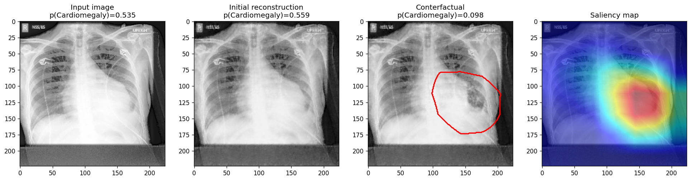

# Local Counterfactuals for Chest X-Ray Images using Saliency Map Guidance

### Abstract
Machine learning for medical imaging diagnosis offers significant promise to improve patient care and make clinicians more efficient. However, due to the high-risk nature of medical diagnosis these images need to be able to produce explanations that are easily interpretable by health-care professionals. Counterfactual explanations are very natural to the medical image domain but are difficult to produce correctly due to the fine anatomical details inherent in a medical image and the often localized nature of an ailment. To solve this we introduce a localized optimization objective that finds a point in learned latent image space that focuses the image modifications on a small, localized region. This localized region corresponds to the saliency map produced by the image classifier. We show that this procedure is able to produce localized counterfactuals in chest X-ray images taken from the CheXpert data set for multiple conditions.

### Repository Overview
- `CheXpert-v1.0-small`: Contains a subset of the [CheXpert data set](https://stanfordmlgroup.github.io/competitions/chexpert/) for validating the approach. Download the full data set for fine-tuning the models.
- `models`: Contains definitions of our custom autoencoder architectures.
- `notebooks`: Contains the notebooks used to train the classifiers, evaluate different saliency maps, and fine-tune the autonencoder.
- `output`: Contains counterfactuals for validation images with `cardiomegaly` in the CheXpert data set.
- `weights`: Contains checkpoints of our trained classifiers and autoencoders.
- `local_counterfactuals.ipynb` The code to generate counterfactuals.

### Run the code
`local_counterfactuals.ipynb` can be executed locally on a machine without a GPU. All files are includes in this repository.

The notebooks in `notebooks` are meant to be executed on Google Colab. For that you will need to download the CheXpert data set and upload it to your Google Drive. Then you can mount your Google Drive in the notebook and run the code:
- `DeepAUC_Fine_Tuning_and_Saliency_Maps`: 
- `Finetune_classifier_chexpert`: 
- `NIH_Bounding_Boxes_IoU`: 

